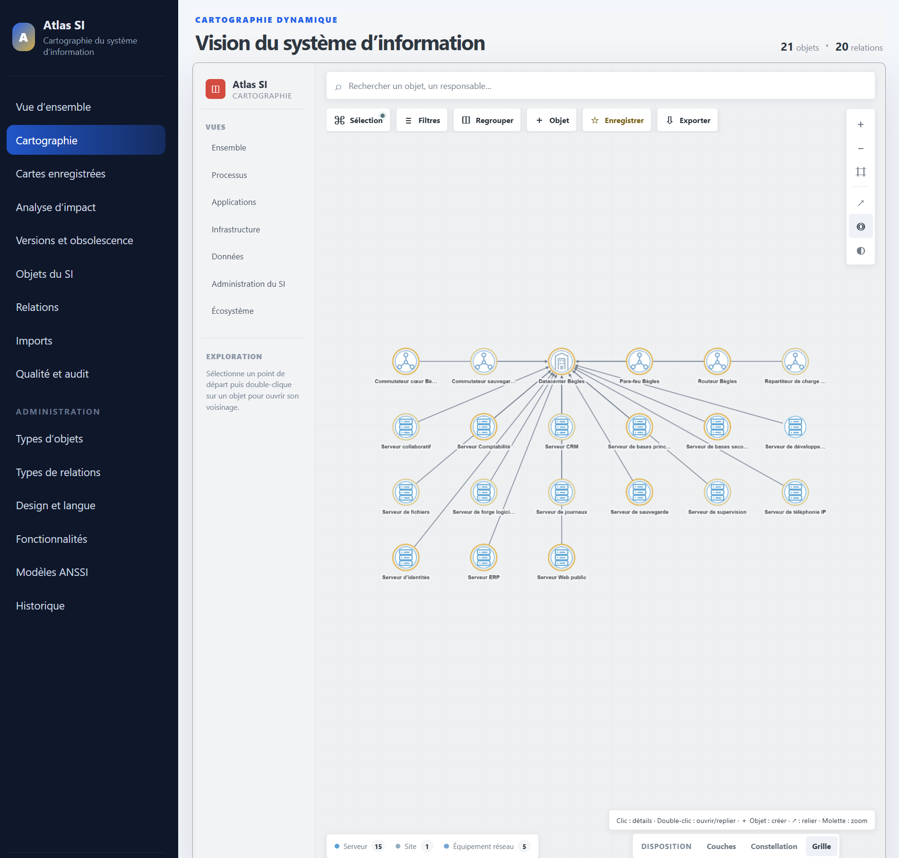

# Atlas SI

> Plateforme libre et auto-hébergée de cartographie du système d’information.

Atlas SI permet de documenter, relier et visualiser les **applications**, **infrastructures**, **données**, **processus**, **sites** et **dépendances** d’une organisation dans un référentiel entièrement configurable.

L’objectif est de fournir aux DSI, RSSI, architectes et responsables techniques un outil visuel, souverain et accessible, sans imposer une CMDB lourde ni un modèle d’architecture figé.

> **Version actuelle : 2.2.0**  
> **Statut : version communautaire**

## Aperçu



## Points forts

- référentiel de types d’objets et de relations personnalisables ;
- vues processus, applicative, infrastructure et données ;
- cartographie interactive avec Cytoscape.js ;
- exploration progressive ou imbriquée par niveaux de granularité ;
- regroupements par type, étiquette ou information complémentaire ;
- cartes enregistrées et constructeur de cartes en pleine page ;
- création d’objets et modification de relations depuis la cartographie ;
- analyses d’impact et exploration des dépendances ;
- gouvernance, responsables, criticité, dates de revue et qualité des données ;
- modèles inspirés du guide de cartographie du SI de l’ANSSI ;
- imports CSV et JSON ;
- exports PDF A3 détaillé, PNG haute définition et JSON ;
- authentification locale ou OpenID Connect avec Keycloak ;
- personnalisation de l’identité visuelle et des langues ;
- déploiement auto-hébergé avec Docker Compose ;
- publication configurable en HTTP ou HTTPS, sur le port choisi.

## Exemples d’utilisation

- cartographier un patrimoine applicatif et ses dépendances ;
- représenter les sites, réseaux, serveurs, applications et bases de données ;
- distinguer des zones comme `LAN`, `DMZ` ou `VOIP` grâce aux étiquettes ;
- préparer une analyse d’impact avant un changement ;
- produire une cartographie exploitable lors d’un audit ou d’une démarche de sécurité ;
- centraliser les responsables, niveaux de criticité et échéances de revue ;
- constituer un référentiel commun entre la DSI, le RSSI et les métiers.

## Aperçu du fonctionnement

Une carte peut être construite avec plusieurs niveaux, par exemple :

```text
Sites
└── Zones réseau : LAN / DMZ / VOIP
    └── Serveurs et équipements réseau
        └── Applications
            └── Bases de données
```

Un double-clic permet d’ouvrir ou de replier progressivement les branches de la cartographie. La structure, les filtres et les regroupements sont enregistrables dans des cartes réutilisables.

<!-- Ajoutez ici d'autres captures :
- docs/images/atlas-si-constructeur-cartes.png
- docs/images/atlas-si-regroupement-network.png
- docs/images/atlas-si-export-pdf.png
-->

## Architecture technique

- **Base de données :** PostgreSQL ;
- **API :** FastAPI, SQLAlchemy et Alembic ;
- **Interface :** React, TypeScript, Vite et Cytoscape.js ;
- **Passerelle Web :** Nginx ;
- **Authentification :** locale ou Keycloak/OpenID Connect ;
- **Déploiement :** Docker Compose.

## Installation rapide

### Prérequis

- une distribution Linux récente ;
- Docker Engine avec le module Docker Compose ;
- un nom DNS et un certificat TLS pour une installation de production en HTTPS.

### Installation

```bash
sudo mkdir -p /opt/atlas-si
sudo chown "$USER":"$USER" /opt/atlas-si

git clone https://github.com/loto33520/Atlas-SI.git /opt/atlas-si
cd /opt/atlas-si

sudo ./scripts/prepare-install.sh local
sudo ./scripts/check-config.sh
sudo docker compose build --pull
sudo docker compose up -d
```

Pour utiliser Keycloak :

```bash
sudo ./scripts/prepare-install.sh keycloak
```

### Laboratoire en HTTP

Exemple de configuration dans `.env` :

```dotenv
GATEWAY_SCHEME=http
GATEWAY_PORT=8080
PUBLIC_BASE_URL=http://serveur-lab.example.org:8080
COOKIE_SECURE=false
```

Pour la production, utilisez HTTPS avec un certificat valide.

## Vérifications et diagnostic

```bash
sudo ./scripts/check-config.sh
sudo ./scripts/diagnose.sh
sudo ./scripts/run-tests.sh
sudo docker compose ps
```

## Documentation

La documentation complète se trouve dans [`docs/`](docs/README.md).

Documents principaux :

- guide d’installation et d’exploitation ;
- guide d’administration fonctionnelle ;
- stockage, sauvegarde et restauration ;
- authentification locale et OpenID Connect ;
- cartographie, cartes enregistrées et constructeur de cartes ;
- export PDF A3, PNG et JSON ;
- modèle de données et MCD.

## Stockage et sauvegardes

Les données principales sont stockées dans PostgreSQL, dans le volume Docker nommé par défaut `atlas_postgres_data`. Les certificats sont montés depuis le dossier local `certs/` et les sauvegardes générées par les scripts sont placées dans `backups/`.

Consultez [`docs/STOCKAGE_ET_SAUVEGARDE.md`](docs/STOCKAGE_ET_SAUVEGARDE.md) avant toute mise en production.

## Sécurité

Ne publiez jamais :

- votre fichier `.env` ;
- vos mots de passe ou secrets OpenID Connect ;
- vos certificats et clés privées ;
- vos sauvegardes PostgreSQL ;
- des exports contenant des données réelles de votre système d’information.

Pour signaler une vulnérabilité, consultez [`SECURITY.md`](SECURITY.md).

## Feuille de route envisagée

- connecteurs GLPI, NetBox, VMware, Proxmox, Active Directory et Entra ID ;
- synchronisation et contrôle renforcé de l’actualisation des données ;
- tableaux de bord de gouvernance supplémentaires ;
- amélioration continue des exports et des modèles de cartographie ;
- enrichissement des fonctions liées à la sécurité et à la conformité.

Les propositions et contributions sont les bienvenues dans les tickets GitHub.

## Contribuer

Les corrections, améliorations, traductions, modèles et contributions documentaires sont les bienvenus.

Avant de proposer une modification, consultez [`CONTRIBUTING.md`](CONTRIBUTING.md).

## Soutenir le projet

Atlas SI est développé et maintenu sur du temps personnel. Si le projet vous est utile, vous pouvez soutenir son développement, sa documentation et son infrastructure par une contribution volontaire :

**[Soutenir Atlas SI avec PayPal](https://www.paypal.me/oliviertocanier)**

Les contributions sont facultatives, sans contrepartie contractuelle et n’ouvrent pas droit à un avantage fiscal.

## Indépendance vis-à-vis de l’ANSSI

Atlas SI est un projet indépendant. Il n’est ni édité, ni certifié, ni approuvé par l’ANSSI.

Les modèles proposés sont **inspirés du guide de cartographie du système d’information de l’ANSSI** et restent entièrement adaptables par l’administrateur.

## Licence

Atlas SI est distribué sous licence **GNU Affero General Public License v3.0**. Consultez le fichier [`LICENSE`](LICENSE).

Vous pouvez utiliser, étudier, modifier et redistribuer le logiciel dans le respect de cette licence. Une version modifiée proposée à des utilisateurs au travers d’un réseau doit également leur donner accès au code source correspondant.

Copyright © 2026 Olivier Tocanier et les contributeurs d’Atlas SI.

## Remerciements

Atlas SI s’appuie notamment sur PostgreSQL, FastAPI, SQLAlchemy, React, TypeScript, Vite, Cytoscape.js, Nginx et Docker.
